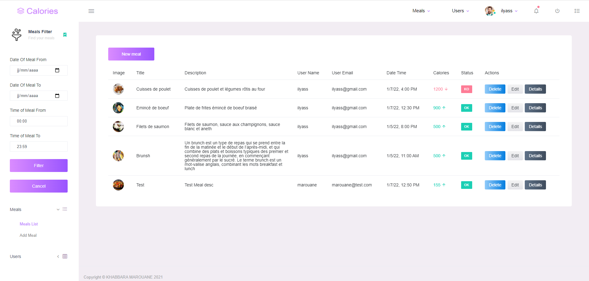

# Input calories

This project was generated with [Angular CLI](https://github.com/angular/angular-cli) version 10.1.7.

<h1>Demo</h1>

## 

<h2>The requirements for this project are</h2>
<ul>
<li>Write an application for the input of calories</li>
<li>User must be able to create an account and log in.</li>
<li>When logged in, a user can see a list of his meals, also he should be able to add, edit and delete meals. (user enters calories manually, no auto calculations!)</li>
<li>Implement at least three roles with different permission levels: a regular user would only be able to CRUD on their owned records, a user manager </li>
<li>would be able to CRUD users, and an admin would be able to CRUD all records and users.</li>
<li>Each entry has a date, time, text, and num of calories.</li>
<li>Filter by dates from-to, time from-to (e.g. how much calories have I had for lunch each day in the last month if lunch is between 12 and 15h).
</li>
<li>User setting – Expected number of calories per day.</li>
<li>When meals are displayed, they go green if the total for that day is less than expected number of calories per day, otherwise they go red.
</li>
</ul>

## Development server

Run `ng serve` for a dev server. Navigate to `http://localhost:4200/`. The app will automatically reload if you change any of the source files.

## Build

Run `ng build` to build the project. The build artifacts will be stored in the `dist/` directory. Use the `--prod` flag for a production build.

## Running unit tests

Run `ng test` to execute the unit tests via [Karma](https://karma-runner.github.io).

## Running end-to-end tests

Run `ng e2e` to execute the end-to-end tests via [Protractor](http://www.protractortest.org/).

## Further help

To get more help on the Angular CLI use `ng help` or go check out the [Angular CLI README](https://github.com/angular/angular-cli/blob/master/README.md).
